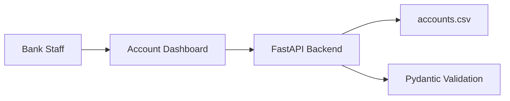

# Bank Account Management System Architecture

## Overview
This project is a simple full-stack bank account management system with FastAPI, CSV persistence, and an HTML/JavaScript dashboard.

## Components
- Frontend account dashboard with add and delete actions
- REST API with `/accounts` endpoints
- Pydantic validation
- `accounts.csv` storage

